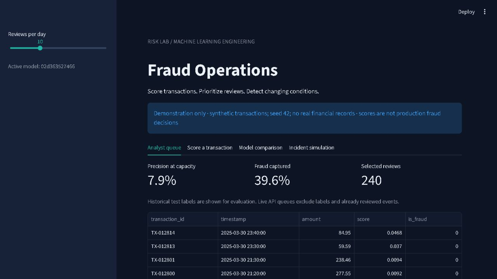
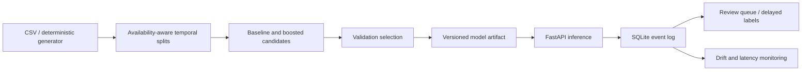

# Fraud Detection Platform

A reproducible fraud modelling and serving project with delayed-label temporal splits, an analyst queue, idempotent scoring, local event storage, drift monitoring and explicit model version activation.



## Run locally

Verified with Python 3.14:

```bash
python -m venv .venv
# Windows: .venv\Scripts\activate
# macOS/Linux: source .venv/bin/activate
pip install -r requirements.txt
python -m fraud.train
python -m pytest -q
streamlit run app.py
```

Start the service in another terminal:

```bash
uvicorn fraud.api:app --host 127.0.0.1 --port 8003
python -m fraud.replay --limit 200
python -m fraud.replay --limit 200 --incident
```

API documentation: `http://127.0.0.1:8003/docs`.

| Endpoint | Behaviour |
|---|---|
| `POST /predict` | Score and persist a transaction; exact retries return the original score |
| `POST /labels` | Record a delayed outcome; reject conflicting labels |
| `GET /queue?budget=10` | Highest-scoring unlabelled transactions received today (UTC) |
| `GET /monitor` | Recent event count, latency, label coverage and input PSI |
| `GET /health` | Active model version and readiness |

Example scoring payload:

```json
{"transaction_id":"DEMO-1","amount":240,"hour":2,"account_age_days":15,"distance_km":250,"transactions_1h":7,"international":0,"device_new":1}
```

## Data and evaluation

The bundled transactions are **synthetic**, generated with seed 42. They contain probabilistic fraud labels and a three-day label delay, not real customer or payment information. Scores are demonstrations and must not be used for actual financial decisions.

Training uses the first 60% of time, validation the next 20%, and final testing the last 20%. Labels unavailable at the training or validation cutoff are excluded. Feature transforms are fit only on training data. All supplied features must be available at prediction time; the API assumes upstream feature computation, not a streaming feature store.

Logistic regression and histogram gradient boosting are compared. The active model is chosen using **validation average precision**, never final-test performance. Reports include average precision, ROC-AUC, Brier score and precision/recall at a daily review budget. Average precision is not identical to trapezoidal PR-AUC. See [results](reports/RESULTS.md) and [raw report](reports/evaluation.json).

## Architecture



`runtime/events.sqlite` is created automatically and ignored by Git. Set `FRAUD_DB` to override the local database path. Runtime data and model binaries are not committed. `python -m fraud.train` regenerates model artifacts in a fresh clone.

## Model versions and rollback

Training writes a versioned joblib artifact and updates `artifacts/current.txt`. Previous local artifacts are retained. To activate an existing version:

```bash
python -m fraud.registry VERSION
```

The API reads the pointer on requests and caches artifacts by version. Identical transaction retries preserve the original model score even after a version change. Promotion/rollback is a local CLI operation, not a public administration endpoint. Version IDs identify training data and selected model name; they are not a complete experiment registry or software provenance hash.

## Monitoring and limitations

The incident simulation increases amount and distance distributions. PSI > 0.2 is a heuristic alert, not evidence of model failure. Monitoring waits for 100 events before returning PSI and never automatically retrains. Labelled metrics can be biased when only reviewed transactions receive outcomes. The replay command measures sequential local HTTP latency, not production capacity.

The dashboard's historical queue and interactive scoring run locally; the API's live queue is separate. SQLite and a single-process service are appropriate for this demo. Authentication, distributed feature computation, model governance, robust calibration and real-world validation are future deployment work.

## Bring your own data

```bash
python -m fraud.train --csv data/private/transactions.csv
```

The schema is illustrated by `data/schema_example.csv`. Required fields are transaction_id, timestamp, label_available_at, is_fraud and the seven features in `fraud/core.py`. At least 1,000 rows and both label classes in every temporal split are required. Keep private inputs in the ignored folder and review generated reports before publishing.

## Docker and checks

```bash
docker build -t fraud-platform .
docker run --rm -p 8503:8501 fraud-platform
# API alternative:
docker run --rm -p 8003:8003 fraud-platform uvicorn fraud.api:app --host 0.0.0.0 --port 8003
```

Tests cover temporal label availability, review budgets, drift, invalid data, idempotency, conflict handling, delayed outcomes and API validation. Never load untrusted joblib files.

Created with AI coding assistance. Reproduce the runs and understand the failure modes before presenting this work. MIT licensed; generated synthetic data uses the same licence.
